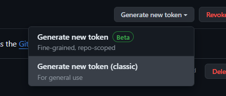

# วิธีใช้ GIT แบบย่อๆ 💻

<span style="font-size:1.2em;">*<b>ผู้เขียน</b><br>ณัฐนนท์ วงศ์หนองแวง 65070076*</span>


## Index 📚

- [<span style="font-size:1.2em;"><b>เตรียมพร้อมใช้งาน Git และ Github</b></span>](#)
    - [คำสั่งตั้งค่า user email editor และ วิธีเก็บข้อมูลการ login](#คำสั่งตั้งค่า-user-email-editor-และ-วิธีเก็บข้อมูลการ-login)
    - [การสร้าง token เพื่อใช้ login](#การสร้าง-token-เพื่อใช้-login)

- [<span style="font-size:1.2em;"><b>เริ่มต้นใช้ GIT ยังไง ?</b></span>](#)
    - [clone จาก repo provider เช่น Github GitLab](#clone-จาก-repo-provider-เช่น-github-gitlab)
    - [สร้าง repo ที่เครื่อง แล้ว push](#สร้าง-repo-ที่เครื่อง-แล้ว-push)

- [<span style="font-size:1.2em;"><b>เริ่มต้นใช้ GIT ยังไง ?</b></span>](#)
    - ดึงจาก Repo คนอื่น
    - สร้าง repo ที่เครื่อง แล้ว push

- [<span style="font-size:1.2em;"><b>เริ่มต้นใช้ GIT ยังไง ?</b></span>](#)
    - ดึงจาก Repo คนอื่น
    - สร้าง repo ที่เครื่อง แล้ว push


### เตรียมพร้อมใช้งาน Git และ Github


#### คำสั่งตั้งค่า user email editor และ วิธีเก็บข้อมูลการ login

```bash
$ git config --global user.name "John Doe"
$ git config --global user.email johndoe@example.com
$ git config --global core.editor "code --wait"
$ git config --global credential.helper cache
$ git config --list
```


#### การสร้าง token เพื่อใช้ login

1. ไปที่่ profile ของเราและเลือก Settings หรือ สามารถกดตามลิ้งค์ด้านล่างได้ <br>
https://github.com/settings/profile

2. ทาง tab ด้านซ้าย เลื่อนลงมาล่างสุดจะเห็นคำว่า Developer settings


3. ไป Personal access tokens > Tokens (classic) จากนั้นทางด้านขวาให้กด Generate new token



สามารถตั้งค่าต่างๆ กับ token ได้ เช่น วันหมดอายุ สิทธิ์การเข้าถึงต่างๆ


### เริ่มต้นใช้ GIT ยังไง ?
มีอยู่ 2 แบบ คือ
1. clone จาก repo provider เช่น Github GitLab
2. สร้าง repo ที่เครื่อง แล้ว push

#### clone จาก repo provider เช่น Github GitLab

ใช้ ```git clone <url>``` เป็นการ clone repo จาก \<url\> 
<br><br>
*ตัวอย่าง*

```bash 
git clone https://github.com/endphaze/MyGitNote.git
```


#### สร้าง repo ที่เครื่อง แล้ว push

```bash
git init
git echo 'test' > README.md
git branch -m main 
git add * ///add file ไป staged เตรียมถ่ายรูป
git commit -m 'first commit eiei' ถ่ายรูป
git 

```
